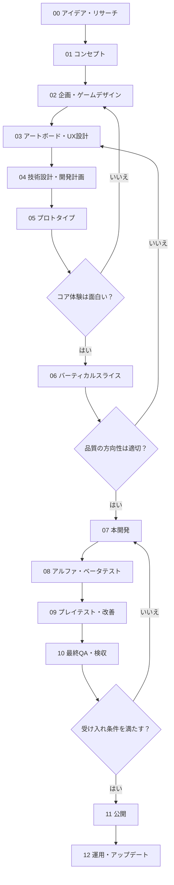

# shoot-mata

LLM が自律的にゲームを作るプロジェクトです。

## 現在の進捗

フェーズ00〜04の企画・設計を記録し、フェーズ05の仮素材プロトタイプを開発中です。現時点の試作はキーボード操作に対応し、タイトルからゲームオーバー／クリアとリトライまで動きます。回収とバーストを含む連続プレイの評価は未完了です。詳細は [フェーズ05レビュー](docs/05-prototype-review.md) を参照してください。

```sh
cd phase05
npm ci
npm run dev
```

表示されたローカルURLをブラウザで開きます。確認コマンドは `npm test`、`npm run typecheck`、`npm run build` です。Node.js 24 を使用します。

## 開発物

- 90年代アーケードシューティングをイメージしたブラウザで遊べる横スクロールシューティングゲーム
- 多彩なステージ構成、特徴的なパワーアップシステム
- 90年代アーケードゲームを遊んできた人には、懐かしくも新しい

## 開発コンセプト

- LLM が開発ループを回す。開発ループをも修正し、より良い製品を作る
- 最初の指示以外は人間がなるべく関与しない

## 基本方針

1. **面白さを先に検証する。** 完成度の高い絵や大量のコードより、まず「遊んで面白いか」を確かめる。
2. **AIに一度に全部作らせない。** フェーズと小さな作業単位で依頼し、各段階で動作を検証する。
3. **動くゲームを常に維持する。** 可能な限り、どの時点でも起動・プレイ・リトライできる状態を保つ。
4. **仕様・アート・実装を分けて記録する。** AIが別セッションになっても、決定事項を再現できるようにする。
5. **検収基準を先に決める。** 「できた」の判断を実装量ではなく、プレイ体験と明確な受け入れ条件で行う。
6. **必要に応じて前のフェーズへ戻る。** この流れはウォーターフォールではなく、反復型の開発プロセスとする。

## ドキュメント
- 企画、仕様、フェーズごとの開発タスク、進捗などは細かくドキュメントにし、 docs/ に格納する
- 開発中に、もっとよくなるように、ドキュメントは常に更新していく。この README.md も例外ではない
- 全体を通した開発ログを作成する

### 開発ログ

- docs/log.md に各フェーズで実行したことを記録する。手戻りが発生した場合なども全て消さずに残す

## フェーズごとの進行ゲート

- フェーズごとの成果物はディレクトリを分け、後から確認できるようにする phase01, phase02, phase03 ...
- 企画書、アートボード、アセット、開発中のプレイアブルなゲームなど
- AIエージェントはフェーズ終了時に次の形式をレポートとして残す
- 各フェーズ開始時にフェーズの目的、受け入れ条件を明確にする
- 各フェーズ開始時に、フェーズ内でやることを細かく分け PLAN.md に記録し、タスク化して開発順序を明確にする
- 各フェーズ完了時に、受け入れ条件を確認し、受け入れが難しい場合は、フェーズをやりなおす
- 各フェーズ完了時に、コンセプトや設計方針が守られているかを確認する。また必要であればコンセプトや設計方針に手を加えてもよい。その場合はドキュメントを改訂する

```md
### フェーズ完了レポート
- フェーズ：
- 目的：
- 作成・変更したファイル：
- 完了したこと：
- 動作確認・テスト結果：
- 未確認事項・既知の問題：
- 仕様からの変更点と理由：
- 次の作業候補：
```
## AIエージェントの作業ルール

開発を担当するAIには、以下を共通指示として与える。

1. 作業開始時に `README.md` と関連する `docs/` を読み、現在フェーズ・MVP範囲・受け入れ条件を把握する。
2. 作業前に、目的、変更対象、完了条件、確認方法を短く示す。
3. 最初は最小の動く実装を作り、一度に広範囲を書き換えない。1タスクごとに main に git コミットする
4. 変更後は可能な範囲でビルド・テスト・ブラウザでのプレイを確認する。実行できなかった確認は明記する。
5. UI・見た目の変更はスクリーンショットで、操作・ゲーム進行の変更は実プレイまたは自動操作で確認する。
6. 不具合は原因と再現手順を記録し、テスト追加が可能なら再発防止に使う。
7. 既存の動作・保存データ・アセットを無断で壊さない。破壊的変更は事前に明示する。
8. 実装中の新アイデアは原則バックログへ記録し、現在のMVPを膨らませない。
9. フェーズ終了時に成果物、テスト結果、未解決事項、次の作業を報告する。フェーズ終了時に git push する

## 開発フェーズ一覧



| フェーズ | テーマ | 完了時に手元にあるもの |
| --- | --- | --- |
| 00 | アイデア・リサーチ | アイデア候補、参考作品、仮説 |
| 01 | コンセプト | 一文コンセプト、プレイヤー体験の核 |
| 02 | 企画・ゲームデザイン | 企画書、ゲームループ、MVP範囲、受け入れ条件の初稿 |
| 03 | アートボード・UX設計 | ムードボード、アート方針、画面構成、操作フロー |
| 04 | 技術設計・開発計画 | 技術選定、設計方針、タスク分解 |
| 05 | プロトタイプ | 最小限の見た目で遊べる試作品 |
| 06 | バーティカルスライス | 一部分を完成品質に近づけた試作品 |
| 07 | 本開発 | MVPに必要な機能とアセットの実装 |
| 08 | アルファ・ベータテスト | 安定して遊べる候補版、テスト記録 |
| 09 | プレイテスト・改善 | 観察結果、改善優先順位、調整済みビルド |
| 10 | 最終QA・検収 | 合格したリリース候補版、検収記録 |
| 11 | 公開 | 本番URL、公開手順、運用情報 |
| 12 | 運用・アップデート | 不具合修正、分析結果、次期改善計画 |

---

## 00. アイデア・リサーチ（Discovery）

**目的：** 作る価値のあるアイデアを発見し、比較する。

**やること**
- 遊びの種を複数出す。既存ジャンルの組み合わせやブラウザならではの制約も発想に使う。
- 参考ゲームの面白さ・操作・テンポ・不満点を分解する。
- 実装難度、差別化、リプレイ性、制作コストを概算する。
- AIが不確かな情報を調べた場合は、推測と確認済みの事実を分ける。

**成果物：** `docs/00-ideas.md`

**完了条件：** 複数のアイデアを出し、最も試したいアイデアを1つ選び、選定理由を言語化できる。

## 01. コンセプト（Concept）

**目的：** 「何が楽しいゲームなのか」を明確にする。

**やること**
- 一文コンセプト、プレイヤー像、感情的なゴールを定義する。
- コアメカニクスと、このゲーム独自のフックを決める。
- 最初の10秒、最初の1分、繰り返し遊ぶ動機を考える。
- 「このゲームではやらないこと」も決める。

**成果物：** `docs/01-concept.md`

**完了条件：** 説明を聞いた人が「プレイヤーが何をして、何を楽しむか」を想像できる。

## 02. 企画・ゲームデザイン（Game Design）

**目的：** コンセプトをプレイ可能なルールに落とし込む。

**やること**
- コアループ（入力 → ゲーム状態の変化 → フィードバック → 次の行動）を定義する。
- 勝利・敗北・終了条件、スコア、難易度、進行、リトライを決める。
- 画面一覧、画面遷移、チュートリアル、プレイ中の情報表示を設計する。
- **MVP（最小限の完成版）** と後回しにする要素を分ける。
- 機能ごとにプレイヤー視点の受け入れ条件を記述する。

**成果物：** `docs/02-game-design.md`（GDD）、`docs/02-mvp.md`

**完了条件：** 第三者や別のAIエージェントが、コアループとMVP範囲を誤解なく説明できる。

## 03. アートボード・UX設計（Art Direction / UX）

**目的：** ゲームの見た目、手触り、情報の伝わり方を統一する。

**やること**
- ムードボードを作り、色、形、線、質感、アニメーション、演出の方向性を定める。
- コンセプトアート、キャラクター、背景、UI、タイトル画面のラフを検討する。
- 画面サイズ、アスペクト比、レイアウト、可読性、タッチ領域を設計する。
- 操作時のフィードバック（音、エフェクト、揺れ、スコア表示等）を考える。
- AI生成素材を使う場合は、素材ごとの**サイズ・透過・命名・配色・統一ルール**を定める。
- 参考作品の画像をそのまま流用せず、利用権利とライセンスを確認する。

**成果物：** `docs/03-art-direction.md`、`docs/03-ux.md`、必要に応じて `assets/concepts/`

**完了条件：** 複数の素材を作っても統一感を保てる基準と、主要画面の構成がある。

> アートボードは方向性を決めるためのもの。ここで全アセットを完成させる必要はない。まず仮素材で遊び、面白さが確認できてから本制作を進める。

## 04. 技術設計・開発計画（Technical Design）

**目的：** 小さく作り始め、後から変更できる構造を整える。

**やること**
- 2D/3D、描画方式、フレームワーク、ビルド・公開方法を選ぶ。
- ゲーム状態、入力、物理・衝突、描画、サウンド、UI、保存の責務を分離する。
- PC/スマートフォン対応、画面のリサイズ、音声再生制限、フォーカス喪失時の挙動を考える。
- テスト、Lint、型チェック、開発サーバー、CIの最低限を準備する。
- MVPを小さなタスクに分け、依存関係と優先順位を付ける。

**技術選定の例（必須ではない）**
- 軽量な2Dゲーム：TypeScript + Canvas 2D
- 2Dゲームエンジン：Phaser / PixiJS など
- 3Dゲーム：Three.js など
- 開発基盤：Vite など
- 自動テスト：単体テスト + Playwright など

**成果物：** `docs/04-technical-design.md`、`docs/04-task-list.md`

**完了条件：** 起動・ビルド・テストの方法が定義され、最初の実装タスクが着手できる。

## 05. プロトタイプ（Prototype）

**目的：** **ゲームの核が実際に面白いか**を、最小コストで検証する。

**やること**
- 仮素材（四角形、単色、仮音声等）を使ってコアループを実装する。
- プレイヤー入力、ゲーム進行、成功・失敗、リトライまでをつなぐ。
- プレイして「気持ちよい瞬間」「分かりにくい瞬間」を記録する。
- 必要に応じて複数の操作方式・ルール案を短時間で比較する。

**成果物：** 動くプロトタイプ、`docs/05-prototype-review.md`

**完了条件：** コアループを繰り返し遊べる。面白さと改善点を、実際のプレイに基づいて評価できる。

**判定：** 継続 / 仕様変更 / コンセプト再検討 / 中止

## 06. バーティカルスライス（Vertical Slice）

**目的：** ゲームの一部分を完成品質に近づけ、制作方針を検証する。

**やること**
- 代表的な1ステージ、1モード、または短い1プレイを対象にする。
- 本番想定のアート、UI、エフェクト、音、アニメーションを統合する。
- 入力遅延、テンポ、演出、読みやすさ、負荷を確認する。
- 素材制作・組み込みにかかる労力を確認し、本開発の見積もりを更新する。
- ** 複数のフェーズに分け、複数のバーティカルスライスを作り、それぞれを成果物として残す phase-06-01, 02  **

**成果物：** バーティカルスライス版、`docs/06-vertical-slice-review.md`

**完了条件：** 完成形の品質目標を共有でき、残りのコンテンツを同じ手順で制作できる。

## 07. 本開発（Production）

**目的：** MVPに必要な要素を揃え、一本のゲームとして完成させる。

**やること**
- ゲームルール、ステージ、進行、難易度、スコア、各種演出を実装する。
- キャラクター、背景、UI、サウンド等を本番アセットに置き換える。
- タイトル、プレイ、結果、リトライ、設定、ポーズなどの基本導線を揃える。
- セーブが必要なら保存・復旧・データ移行を設計する。
- タスクを小さく分け、**実装 → 自動テスト → ブラウザで操作確認 → 記録**を繰り返す。
- 新要素を無制限に追加せず、MVP外のアイデアはバックログへ移す。
- ** ステージごとに、複数のフェーズに分け、1ステージずつ作成し、それぞれを成果物として残す phase-07-01, 02 ... **

**成果物：** プレイ可能なMVP、`docs/07-implementation-status.md`

**完了条件：** MVP範囲の機能が揃い、タイトルから終了・再挑戦まで一通り遊べる。

## 08. アルファ・ベータテスト（Alpha / Beta）

**目的：** 不具合を取り除き、さまざまな条件で安定して遊べる状態にする。

**やること**
- **α：** ゲームの全体フロー、主要機能、基本ルールの破綻を確認する。
- **β：** 操作性、難易度、テンポ、演出、対応端末での安定性を確認する。
- 単体テスト、結合テスト、ブラウザE2Eテスト、目視テストを組み合わせる。
- バグを再現手順・期待動作・実際の動作・重大度つきで管理する。
- AIが「実行したテスト」と「未実行で推測していること」を明確に区別する。

**成果物：** α版・β版、`docs/08-qa-plan.md`、不具合一覧

**完了条件：** 主要フローが破綻せず、リリースを妨げる重大な既知不具合がない。

## 09. プレイテスト・改善（Playtest）

**目的：** 作り手ではない人にも伝わり、楽しく遊べるかを検証する。

**やること**
- 初見プレイヤーに、できるだけ説明なしで遊んでもらう。
- 開始までの迷い、操作ミス、離脱地点、再挑戦の有無を観察する。
- 想定端末でのタッチ操作・視認性・プレイ時間を測る。
- 感想だけでなく、実際の行動・詰まった場面を記録する。
- 改善案を「効果 × コスト × 緊急度」で整理し、修正後に再確認する。

**成果物：** `docs/09-playtest-report.md`、改善バックログ

**完了条件：** 主要な体験上の問題が把握され、修正の要否が判断されている。

## 10. 最終QA・検収（Acceptance）

**目的：** 仕様・品質・公開条件を満たしていることを、証拠を残して確認する。

**確認項目**

- [ ] 企画で定めたMVPの必須機能がすべて動作する
- [ ] 起動 → 遊ぶ → 終了 → リトライが成立する
- [ ] 操作説明とゲーム内の情報表示が分かりやすい
- [ ] 対応対象のブラウザ・画面サイズ・入力方式で確認済み
- [ ] レイアウト崩れ、見切れ、操作不能なUIがない
- [ ] ポーズ・タブ切り替え・画面サイズ変更で致命的な問題がない
- [ ] 音のON/OFFやブラウザの音声再生制約を考慮している
- [ ] 保存がある場合、再起動・データ破損時の挙動を確認済み
- [ ] ゲームループやイベントの多重登録、メモリ・負荷の問題を確認済み
- [ ] 自動テスト、ビルド、必要なLint・型チェックが通過する
- [ ] 重大な既知不具合が残っていない
- [ ] 利用している素材・フォント・音源・ライブラリの権利条件を確認済み
- [ ] 公開URL・プライバシー・外部通信・データ取扱いを確認済み（該当時）
- [ ] 未実施テスト・既知の制約を記録している

**成果物：** `docs/10-acceptance.md`、リリース候補版

**完了条件：** 必須チェックが完了し、残存リスクを確認したうえで公開可と判断できる。

## 11. 公開（Release）

**目的：** 誰でもアクセスして遊べる状態にし、再現可能な公開手順を残す。

**やること**
- 本番ビルド・デプロイを行い、公開URLから実際に遊べるか確認する。
- OGP、favicon、ゲーム説明、操作ガイド、共有導線を整える。
- 必要に応じてアクセス解析、エラーログ、バージョン表示を設定する。
- ロールバック方法、キャッシュ更新、リリースノートを準備する。

**成果物：** 本番URL、`docs/11-release.md`

**完了条件：** 本番環境で主要フローを確認済みで、障害時の戻し方が分かる。

## 12. 運用・アップデート（Live Operations）

**目的：** 公開後の実データとフィードバックから、ゲームを改善する。

**やること**
- エラー、パフォーマンス、離脱、リトライ、継続プレイなどを確認する（収集する場合は必要最小限にする）。
- 不具合と改善要望を分けて管理する。
- 新モード、ステージ、演出等を優先度順に追加する。
- 定期的にブラウザ互換性、依存関係、素材の権利条件を点検する。

**成果物：** `docs/12-backlog.md`、更新履歴

**完了条件：** 次に直すこと・追加することが優先順位つきで管理できている。
